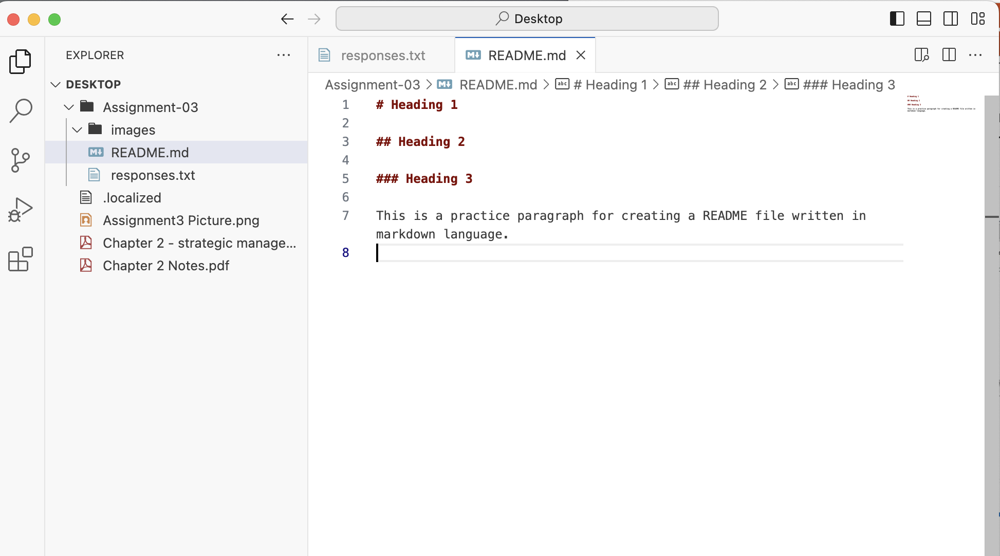

# Heading 1

## Heading 2

### Heading 3

This is a practice paragraph for creating a README file written in markdown language. 

[Click Here](https://www.runwildmissoula.org/membership/member-benefits/?gad_source=1&gclid=CjwKCAjw3P-2BhAEEiwA3yPhwC-7EZN70QZFdxfRd1UTHsGOi0HxwVDldE7y0bQCaCkLsS_KShaXQxoCPIgQAvD_BwE)

[My File](./responses.txt)

